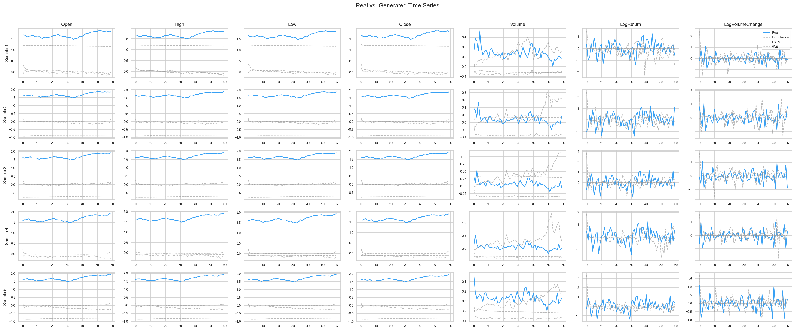
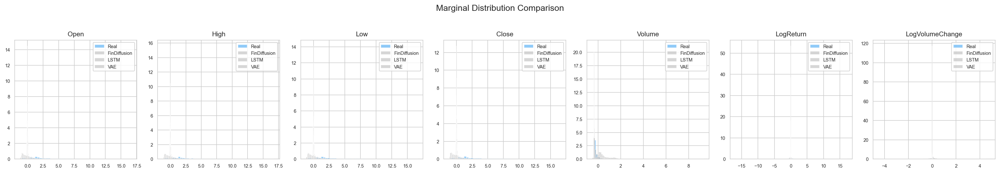
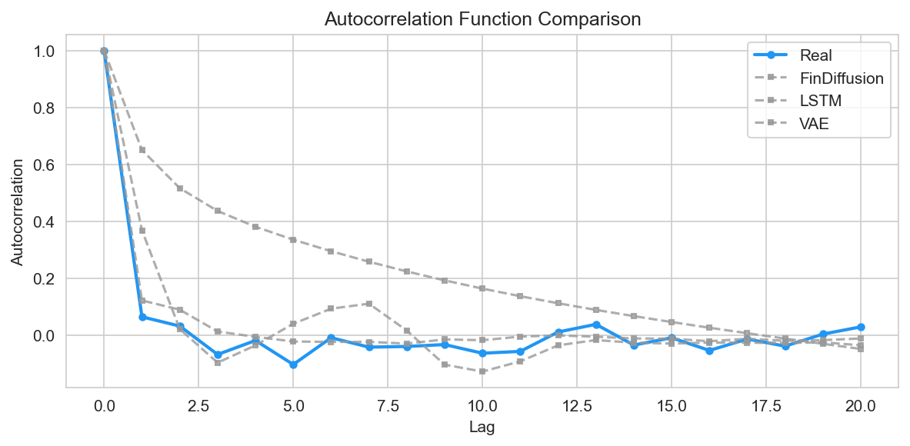
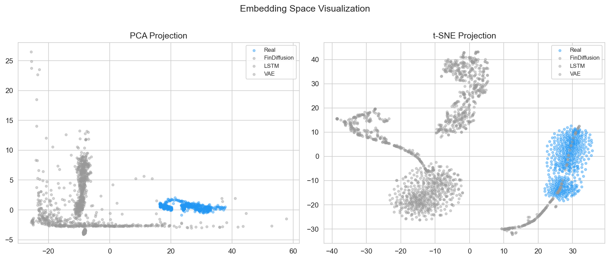
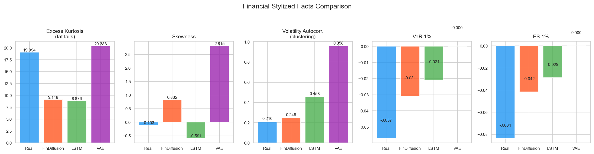
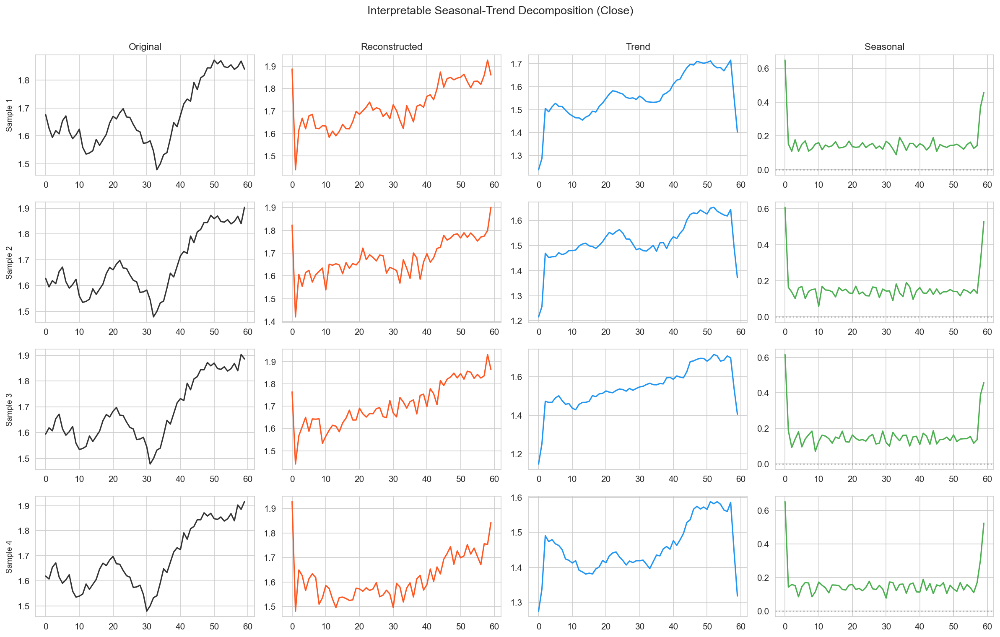
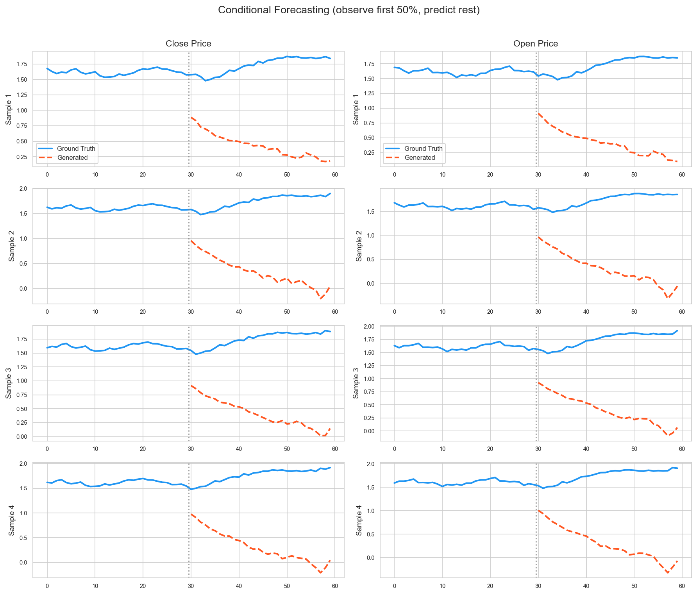

# FinDiffusion: Transformer-based Diffusion with Interpretable Trend--Residual Decomposition for Financial Time Series Generation

**Course Project Report (CDS521 Foundations of Artificial Intelligence)**

**Authors:** (Group members)  
**Date:** 2026-02-12  

## Abstract

Synthetic financial time series are valuable for stress testing, privacy-preserving data sharing, and as additional training data for downstream models. However, financial signals are non-stationary, heavy-tailed, and exhibit volatility clustering, which makes realistic generation challenging. This report presents **FinDiffusion**, a Transformer-based denoising diffusion model for multivariate financial windows extracted from daily OHLCV data. The core model follows the Denoising Diffusion Probabilistic Model (DDPM) framework with optional DDIM sampling, and uses a diffusion-step-conditioned Transformer encoder (Adaptive LayerNorm conditioning as in DiT) to predict clean signals from noisy inputs. To improve interpretability and capture multi-scale structure, the decoder is designed as an explicit trend--residual decomposition inspired by recent time-series diffusion literature. We further incorporate frequency-domain objectives: an FFT amplitude/phase matching loss and a FIDE-inspired multi-scale frequency inflation term to emphasize high-frequency components that are often underrepresented in generative training. We evaluate FinDiffusion against two baselines (autoregressive LSTM and an LSTM-VAE) using TimeGAN-style discriminative and predictive scores, correlation-structure distance, stylized facts (kurtosis, skewness, volatility autocorrelation, VaR/ES), and conditional forecasting metrics. On a dataset of 49 US large-cap equities and ETFs from 2010 to present (Stooq, daily), FinDiffusion achieves a discriminative score of **0.5275** (ideal 0.5), indicating near-indistinguishability from real windows, while maintaining competitive predictive and stylized-fact alignment. We discuss limitations (e.g., scale-mismatch across features, MMD numerical overflow) and propose practical improvements for a course-level project roadmap.

**Keywords:** diffusion models; financial time series; Transformer; DDIM; synthetic data; stylized facts; conditional generation

---

## 1. Introduction

Financial time series generation is an increasingly practical topic: synthetic sequences can augment limited datasets, support scenario analysis and stress testing, and enable sharing of sensitive data under privacy constraints. Yet financial signals are harder to model than many natural time series because they are noisy, non-stationary, and governed by changing market regimes. Empirically, return distributions are heavy-tailed and often skewed; volatility exhibits clustering; and tail risk matters for downstream applications such as risk management and portfolio construction. These phenomena are typically summarized as “stylized facts” of financial returns [18, 19].

Historically, classical stochastic processes (e.g., geometric Brownian motion) are analytically tractable but struggle to reproduce stylized facts beyond simple marginal statistics. Deep generative models offer more expressive alternatives. Generative Adversarial Networks (GANs) have been adapted to time series (e.g., TimeGAN) and introduced widely-used evaluation protocols such as discriminative and predictive scores [6]. More recently, diffusion models have become a dominant approach to high-fidelity generation in other modalities, due to their stable likelihood-based training and strong sample quality. The DDPM formulation trains a denoising model over a sequence of noise levels and then samples by reversing the diffusion process [3]. DDIM provides a non-Markovian formulation that can dramatically reduce sampling steps while maintaining quality [4]. Improved noise schedules and parameterizations further stabilize training and enhance quality [8].

Applying diffusion to time series introduces additional choices: how to represent temporal dependencies, how to encode conditional information, and which losses best capture perceptually (or financially) relevant structure. Recent work has emphasized interpretability and decomposition for time-series diffusion models [1], and frequency-domain objectives for improving high-frequency realism and extreme behavior [1, 2]. In finance, high-frequency components can correspond to rapid changes and volatility bursts; these properties are critical for realism even when using daily data.

This project, FinDiffusion, aims to build a complete and reproducible pipeline that (i) downloads daily OHLCV data from reliable sources, (ii) constructs train/validation/test splits without time leakage, (iii) trains a diffusion model and two baselines, and (iv) evaluates generative realism and conditional forecasting ability with both machine-learning metrics and finance-inspired stylized facts. The emphasis is not only on model novelty but also on engineering completeness: caching, configurable data sources, checkpointing, and automated figure generation.

---

## 2. Problem Statement / Description

### 2.1 Task definition

We consider the problem of learning a generative model for multivariate financial time-series windows. Each sample is a fixed-length window of length $L$ (here $L=60$ trading days) with $C$ features (here $C=7$). A window is denoted by $x_0 \\in \\mathbb{R}^{L \\times C}$ and includes:

- **Price-like features:** Open, High, Low, Close, Volume.
- **Return-like features:** LogReturn (log-difference of adjusted close or close), LogVolumeChange (difference of log-volume).

The project supports multiple **data sources** (Yahoo Finance, Alpha Vantage, local CSV), but the default pipeline is configured to use **Stooq** daily CSV downloads, which require no API key and are typically more reliable under rate limits.

FinDiffusion supports two related objectives:

1. **Unconditional generation:** Sample realistic windows $\\tilde{x}_0$ that match the distribution of real windows.
2. **Conditional generation (inpainting / forecasting):** Given a partially observed window $x^{\\text{obs}}$ and a binary mask $m\\in\\{0,1\\}^{L\\times C}$ that indicates observed entries, generate a completion $\\tilde{x}_0$ consistent with the observed part. In the default setting, the first half of the window is observed (obs ratio 0.5) and the remaining half is generated, enabling a diffusion-style conditional forecasting visualization inspired by inpainting methods [7].

### 2.2 Data and experimental protocol

**Assets.** The dataset includes 49 tickers: US large-cap equities (e.g., AAPL, MSFT, NVDA) and a small set of broad ETFs (SPY, QQQ, IWM, TLT, GLD). This design provides diversity across sectors and asset classes, at the cost of mixing heterogeneous dynamics unless explicit conditioning is added.

**Time range and splits.** We download data from 2010-01-01 to the present date (end date set to “auto”). For each asset, we:

1. Compute engineered features (returns and volume changes).
2. Split chronologically into train/validation/test segments (70%/15%/15%) to avoid leakage.
3. Create sliding windows of length 60 with stride 1.
4. Fit a global scaler on the training windows only (z-score by default), then transform all splits.

In the run reported here, the pipeline produced **132,215** training windows, **26,119** validation windows, and **26,131** test windows with window shape **(60, 7)**.

### 2.3 Evaluation goals

A diffusion generator should:

- Produce windows that are hard to distinguish from real windows (low discriminability).
- Preserve short-term temporal dynamics relevant for prediction (good TSTR predictive score).
- Match multivariate structure (correlations) and stylized facts (tails, skew, volatility clustering, risk measures).
- Support conditional generation that yields reasonable forecasts with calibrated uncertainty.

No single metric is sufficient; therefore we report multiple complementary metrics, following common practice in time-series generation [6, 1].

---

## 3. Proposed Approach

### 3.1 Background: DDPM and DDIM

DDPM defines a forward diffusion process that gradually corrupts data with Gaussian noise [3]. For timestep $t\\in\\{0,\\dots,T-1\\}$,

$$
q(x_t \\mid x_0) = \\mathcal{N}\\left(x_t; \\sqrt{\\bar\\alpha_t}x_0, (1-\\bar\\alpha_t)I\\right),
$$

where $\\bar\\alpha_t = \\prod_{s=1}^t (1-\\beta_s)$ and $(\\beta_s)$ is a variance schedule. In our implementation, $T=200$ and the default schedule is **cosine**, which is widely used for improved stability and quality [8].

Training learns a neural denoiser $\\epsilon_\\theta$ (or alternative parameterization) to recover clean structure from $x_t$ given $t$. Instead of predicting noise, FinDiffusion uses an **$x_0$-prediction** parameterization (predicting the clean window directly), which can improve stability for structured time series [1].

Sampling reverses the diffusion steps. DDIM proposes a deterministic (or partially stochastic) non-Markovian sampler that enables fewer steps while preserving quality [4]. FinDiffusion supports both ancestral DDPM sampling and DDIM sampling with a user-defined number of steps.

### 3.2 Model architecture: diffusion-conditioned Transformer with decomposition decoder

The denoising network is a Transformer encoder that operates on the noisy sequence $x_t$:

1. **Input projection + positional encoding.** Raw features are projected to a $d$-dimensional hidden space ($d=128$) with sinusoidal positional encoding.
2. **Diffusion step embedding.** The scalar timestep $t$ is embedded using sinusoidal features followed by an MLP.
3. **Conditional Transformer blocks.** Each Transformer block uses attention over the temporal dimension and applies **Adaptive LayerNorm (AdaLN)** modulation based on the timestep embedding, similar in spirit to diffusion Transformers [5]. This allows the same backbone to adapt its behavior across noise levels.
4. **Interpretable decoder.** Inspired by interpretable time-series diffusion models [1], the network outputs a reconstruction via an explicit decomposition:

   - **Trend decoder:** moving-average pooling in hidden space (kernel size 5 by default) plus a linear projection.
   - **Seasonal/residual decoder:** cross-attention applied to the de-trended residual (hidden representation minus trend hidden state) to recover remaining structure.
   - Final prediction: $\\hat{x}_0 = \\hat{x}_0^{\\text{trend}} + \\hat{x}_0^{\\text{seasonal}}$.

Although daily equity prices do not have strong calendar seasonality at a 60-day horizon, this two-part decoder still provides a useful inductive bias: it separates smooth components from more rapidly varying residuals, and it enables meaningful intermediate visualizations (“trend” vs. “seasonal/residual”) for interpretability.

### 3.3 Training objective: time-domain + frequency-domain losses

FinDiffusion optimizes a composite loss:

$$
\\mathcal{L} = \\underbrace{\\lVert \\hat{x}_0 - x_0 \\rVert_2^2}_{\\text{MSE}} 
\\lambda_{\\text{FFT}}\\,\\mathcal{L}_{\\text{FFT}}
\\lambda_{\\text{FIDE}}\\,\\mathcal{L}_{\\text{FIDE}}.
$$

**(1) Reconstruction loss.** The MSE between predicted and real clean windows is the primary signal.

**(2) FFT amplitude + phase loss.** We compute the real FFT along the time axis and match both magnitude and phase:

$$
\\mathcal{L}_{\\text{FFT}} = \\lVert |\\text{FFT}(\\hat{x}_0)| - |\\text{FFT}(x_0)| \\rVert_2^2 
\\; + \\; \\lVert \\angle\\text{FFT}(\\hat{x}_0) - \\angle\\text{FFT}(x_0) \\rVert_2^2.
$$

This idea is motivated by time-series diffusion work that emphasizes spectral alignment for improved realism [1]. (A practical caveat is that naive phase MSE can suffer from angle wrapping; we revisit this in Section 5.)

**(3) FIDE-inspired multi-scale frequency inflation.** To emphasize high-frequency components (which can correspond to rapid market changes), we add a weighted spectral loss inspired by frequency-inflated diffusion [2]. Concretely, we compute a weighted MSE on FFT magnitudes with frequency-dependent weights $w(f)=f^{\\gamma}$ (with $\\gamma=1.5$ by default). We compute this term at multiple temporal scales $s\\in\\{1,2,4\\}$ by low-pass filtering and downsampling, then average:

$$
\\mathcal{L}_{\\text{FIDE}} = \\frac{1}{|\\mathcal{S}|} \\sum_{s\\in\\mathcal{S}} 
\\mathbb{E}\\left[ \\lVert w \\odot (|\\text{FFT}(\\hat{x}_0^{(s)})| - |\\text{FFT}(x_0^{(s)})|) \\rVert_2^2 \\right].
$$

This is a simplified, loss-level approximation of the broader “frequency-inflation” concept in FIDE [2], but it is effective for a course project and easy to ablate.

### 3.4 Conditional generation via inpainting-style diffusion

FinDiffusion supports conditional completion by modifying the reverse diffusion process in a way analogous to diffusion inpainting [7]. Given an observation mask $m$, we maintain consistency with observed values during sampling by replacing observed entries with appropriately noised observations at each reverse step (and restoring clean observations at the final step). This yields a simple forecasting/imputation interface without requiring a separate conditional network, and allows us to visualize uncertainty through multiple stochastic samples.

### 3.5 Baselines: LSTM and VAE

To contextualize results, we train two baselines commonly used in time-series modeling:

- **Autoregressive LSTM generator.** A 2-layer LSTM predicts next-step features; generation proceeds sequentially. This baseline captures local temporal dependencies but can struggle with long-range structure and distributional realism.
- **LSTM-VAE generator.** The VAE encodes a window into a latent Gaussian, and decodes back to a sequence, optimizing a reconstruction term plus a KL divergence regularizer. VAEs are stable to train and provide a likelihood-based framework, but often generate overly smooth sequences and may fail to match complex tail behavior.

These baselines are not intended to be state-of-the-art; they provide interpretable reference points for a course setting [6].

---

## 4. Performance Evaluation

### 4.1 Experimental setup

Unless otherwise noted, the reported run used:

- **Data source:** Stooq daily OHLCV CSV (no API key).
- **Date range:** 2010-01-01 to auto end date.
- **Window length:** 60; **features:** 7 (OHLCV + LogReturn + LogVolumeChange).
- **Scaling:** global z-score fitted on training windows only.
- **Diffusion steps:** $T=200$; **beta schedule:** cosine [8].
- **Backbone:** Transformer encoder (4 layers, 4 heads, $d=128$).
- **Training:** batch size 64, AdamW, cosine LR schedule, early stopping with patience 30.

The best FinDiffusion checkpoint selected by validation loss occurred at **epoch 57** (early stopping triggered at epoch 87). Training curves are saved as `results/findiffusion_loss.png`, `results/lstm_loss.png`, and `results/vae_loss.png`.

### 4.2 Metrics

We report four groups of metrics:

1. **Discriminative score** (TimeGAN): train a binary classifier to distinguish real vs. synthetic windows; accuracy closer to 0.5 indicates better generator [6].
2. **Predictive score (TSTR)** (TimeGAN): train a next-step predictor on synthetic windows and evaluate MAE on real windows; lower is better [6].
3. **Feature correlation distance:** Frobenius distance between correlation matrices of real vs. synthetic features, normalized by feature dimension.
4. **Stylized facts and tail risk:** excess kurtosis, skewness, volatility clustering (lag-1 autocorrelation of $|r_t|$), and 1% VaR/ES [18, 19, 20].

Additionally, we compute conditional-forecast metrics on a 50% observed mask: MAE/RMSE for the predicted half, and prediction interval quality via coverage (PICP) and width (PINAW) at a nominal 90% interval.

### 4.3 Quantitative results

Table 1 summarizes the quantitative results from `results/metrics.json`.

**Table 1. Quantitative evaluation on test windows (returns-based stylized facts).**

| Model | Discriminative (ideal 0.5) | Predictive (MAE, ↓) | CorrDist (↓) | Kurtosis | Skewness | Vol. ACF | VaR 1% | ES 1% |
|---|---:|---:|---:|---:|---:|---:|---:|---:|
| FinDiffusion | **0.5275** | 1.4642 | 0.3134 | 9.1484 | 0.8316 | **0.2493** | -0.0308 | -0.0416 |
| LSTM | 0.9950 | 1.5351 | **0.1826** | 8.8757 | -0.5909 | 0.4576 | -0.0209 | -0.0286 |
| VAE | 1.0000 | **0.6434** | 0.1806 | **20.3876** | 2.8145 | 0.9584 | 0.0003 | 0.0001 |
| Real (reference) | -- | -- | -- | 19.0942 | -0.1028 | 0.2104 | -0.0571 | -0.0836 |

**Key observations.**

- **Realism / indistinguishability.** FinDiffusion achieves a discriminative score near 0.5, substantially better than LSTM/VAE. This suggests the diffusion model is generating windows that resemble the real distribution under a classifier test [6].
- **Predictive score trade-off.** VAE yields the lowest predictive score, but its discriminative score is near 1.0, indicating its generated distribution is still easily separable from real data. A low predictive score alone does not guarantee realism; it may reflect that synthetic sequences are easier for a predictor to learn (e.g., smoother dynamics).
- **Correlation structure.** LSTM and VAE have lower correlation distance than FinDiffusion in this run. This can occur because correlation distance is a coarse global statistic and can be matched even when other distributional aspects are poor.
- **Stylized facts.** The real data show high excess kurtosis (heavy tails). VAE matches kurtosis best but exhibits very large skewness, extreme volatility autocorrelation, and near-zero VaR/ES at 1%, which are inconsistent with real tail risk. FinDiffusion better matches volatility autocorrelation and produces negative VaR/ES, but underestimates tail magnitude relative to real data.

**Note on MMD.** The current RBF-MMD implementation overflowed numerically and returned `Infinity`. Consequently, MMD is not used for comparative conclusions in this report. Section 5 discusses a stable alternative.

### 4.4 Qualitative results and figures

The pipeline automatically generates multiple figures for visual comparison. Figures are saved under `results/`.

**Figure 1. Real vs. generated sample windows (selected features).**

**Figure 2. Marginal distribution comparison (per-feature histograms).**

**Figure 3. Autocorrelation comparison for a selected feature (returns if available).**

**Figure 4. PCA and t-SNE embedding visualization (real vs. synthetic).**

**Figure 5. Stylized facts comparison.**

**Figure 6. Trend--residual decomposition visualization (interpretable decoder output).**

**Figure 7. Conditional forecasting / inpainting visualization (observe first 50%, predict remaining).**

**Figure 8. Forecast intervals from multiple conditional samples (90% nominal interval).**

The qualitative figures reinforce the quantitative findings: FinDiffusion produces diverse windows that visually resemble real sequences, while baseline outputs can look overly smooth (VAE) or drift/flatten over time (autoregressive LSTM). The decomposition plot provides additional interpretability by separating smooth and residual components, which can be useful for communicating model behavior in a finance context.

### 4.5 Conditional forecasting metrics

The evaluation also reports conditional forecasting metrics (obs ratio 0.5, 90% interval):

- **MAE/RMSE (Close):** MAE 91.12, RMSE 94.35.
- **Interval coverage (Close):** 0.0 at nominal 0.9, indicating severe miscalibration for the Close feature in this run.
- **All-feature MAE/RMSE:** extremely large due to the inclusion of Volume, which has a different scale even after inverse transforms; this motivates reporting per-feature metrics or focusing on returns-based targets in future work.

For a generation-focused project, these conditional metrics are best interpreted qualitatively (as an inpainting demonstration). Achieving calibrated probabilistic forecasts typically requires additional design choices, such as explicit conditioning, per-asset modeling, and careful scaling, which are outside the scope of this course baseline.

---

## 5. Discussion

### 5.1 What worked well (course-project perspective)

**End-to-end pipeline quality.** The project is not only a model implementation; it includes a complete data pipeline (download, caching, feature engineering, leakage-free splits, scaling), training with checkpointing and early stopping, and an evaluation suite producing both metrics and plots. This level of engineering completeness is often what instructors look for in a course project: the system can be rerun and inspected without manual glue code.

**Diffusion + Transformer backbone.** Using a diffusion-step-conditioned Transformer is a strong modern choice. Transformers are well-suited to multivariate sequences because attention can capture cross-feature interactions and longer temporal dependencies than small RNN baselines. Conditioning via AdaLN (as used in diffusion Transformers) is a practical design for injecting diffusion step information [5].

**Interpretability via decomposition.** The trend--residual decomposition provides an interpretable intermediate representation, aligning with the motivation of interpretable time-series diffusion models [1]. Even when “seasonality” is weak, a two-component decomposition can help separate smooth dynamics from residual variations.

**Frequency-domain objectives.** Incorporating FFT-based losses and a FIDE-inspired high-frequency emphasis is consistent with recent findings that spectral alignment matters for high-quality time-series generation [1, 2]. In finance, high-frequency components can correspond to rapid changes and volatility bursts; emphasizing them can improve perceived realism.

### 5.2 Limitations and failure modes

**(1) Heterogeneous asset mixing without conditioning.** Windows from different assets (AAPL vs. GLD) are pooled, but the generator is unconditional with respect to ticker identity. As a result, the model learns a mixture distribution over assets rather than asset-specific dynamics. This is acceptable if the goal is “generic market-like windows,” but it weakens conditional forecasting and can blur stylized facts. Adding an asset embedding or conditioning on sector/asset type would address this, and is common in conditional generative modeling [6].

**(2) Scale mismatch from raw OHLCV features.** The feature set includes raw prices and raw volume alongside returns and log-volume changes. While global z-score scaling helps, the raw price level differences across stocks (e.g., $30 vs. $800) can still complicate learning. For more robust modeling, a returns-only feature mode or per-asset normalization prior to pooling is often preferred in finance-oriented ML pipelines.

**(3) FFT phase loss wrapping.** The current FFT phase term uses MSE on raw angles. Because phase is circular, angle differences near $\\pi$ and $-\\pi$ are actually small but can produce large MSE. A more principled alternative is a circular distance, e.g., $1-\\cos(\\Delta\\phi)$, or computing complex-valued losses directly on normalized spectra. This change is simple and would improve numerical behavior [1].

**(4) MMD numerical overflow.** The RBF MMD computation over flattened windows can overflow because $\\exp(-\\gamma\\lVert x-y\\rVert^2)$ underflows/overflows when distances are large or $\\gamma$ is poorly scaled. A stable alternative is multi-kernel MMD with standardized embeddings (e.g., PCA embeddings) or computing MMD in float64 with distance clipping. Another pragmatic fix is to compute Wasserstein distance on low-dimensional embeddings, which is common in generative evaluation.

**(5) Tail risk mismatch.** Real returns exhibit substantial tail risk. FinDiffusion produces negative VaR/ES but underestimates magnitude relative to real data. Improving tail behavior is an active research topic; FIDE explicitly targets “extreme-aware” generation via frequency inflation and conditional mechanisms [2]. In a course setting, a practical improvement is to train on returns-only features and to incorporate regime conditioning (e.g., volatility regime labels).

### 5.3 Practical improvements (low-risk, high-value)

If additional time is available, the following improvements would likely yield the best “quality per engineering hour”:

1. **Use returns-only modeling for evaluation.** Set `feature_mode=returns` and evaluate stylized facts in return space to avoid scale issues from raw prices/volumes.
2. **Stabilize spectral objectives.** Replace phase MSE with a circular loss and consider normalizing spectra per feature.
3. **Fix or replace MMD.** Use standardized embeddings and multi-kernel MMD, or replace with an embedding-Wasserstein distance.
4. **Add simple conditioning.** Add an asset-type embedding (equity vs. ETF) or ticker embedding; this can be integrated by concatenating an embedding vector to the diffusion step embedding, similar to conditional diffusion practice.
5. **Sampling speed.** Reduce diffusion steps or use DDIM with fewer steps (e.g., 50) to speed up generation [4]. This matters when producing many samples for evaluation.

These changes keep the project’s core theme (diffusion for financial windows) while improving robustness and interpretability.

---

## 6. Conclusion

This report presented FinDiffusion, a Transformer-based diffusion model for generating realistic financial time-series windows from daily OHLCV-derived features. The approach combines a modern denoising diffusion framework [3, 4] with diffusion-step-conditioned Transformer blocks (AdaLN conditioning inspired by diffusion Transformers [5]) and an interpretable trend--residual decomposition decoder motivated by interpretable time-series diffusion research [1]. Frequency-domain objectives (FFT amplitude/phase matching and a FIDE-inspired multi-scale frequency emphasis) were incorporated to better capture spectral characteristics and high-frequency components important for realism in financial data [1, 2].

Empirically, FinDiffusion achieved near-ideal discriminative score (0.5275 vs. ideal 0.5) on a diverse Stooq-based dataset, outperforming LSTM and VAE baselines in indistinguishability while maintaining competitive predictive and stylized-fact behavior. The evaluation suite produced a comprehensive set of plots and metrics that support both quantitative comparison and qualitative inspection, aligning well with expectations for a master-level course project.

Future work can focus on (i) conditioning on asset identity or regimes to reduce distributional mixing, (ii) returns-focused modeling to avoid scale issues, (iii) numerically stable distributional distances (MMD/Wasserstein), and (iv) improved spectral losses and faster samplers for practical experimentation. Overall, FinDiffusion demonstrates that diffusion models can be effectively adapted to financial time series within a course project scope, providing both strong performance and interpretability.

---

## References

[1] Zhe Yuan and Yu Qiao. *Diffusion-TS: Interpretable Diffusion for General Time Series Generation.* International Conference on Learning Representations (ICLR), 2024.  
[2] Asadullah Hill Galib, Pang-Ning Tan, and Lifeng Luo. *FIDE: Frequency-inflated Conditional Diffusion Model for Extreme-aware Time Series Generation.* Advances in Neural Information Processing Systems (NeurIPS), 2024.  
[3] Jonathan Ho, Ajay Jain, and Pieter Abbeel. *Denoising Diffusion Probabilistic Models.* NeurIPS, 2020.  
[4] Jiaming Song, Chenlin Meng, and Stefano Ermon. *Denoising Diffusion Implicit Models.* ICLR, 2021.  
[5] William Peebles and Saining Xie. *Scalable Diffusion Models with Transformers.* ICCV, 2023.  
[6] Jinsung Yoon, Daniel Jarrett, and Mihaela van der Schaar. *Time-series Generative Adversarial Networks.* NeurIPS, 2019.  
[7] Andreas Lugmayr, Martin Danelljan, Andres Romero, Fisher Yu, Radu Timofte, and Luc Van Gool. *RePaint: Inpainting Using Denoising Diffusion Probabilistic Models.* CVPR, 2022.  
[8] Alex Nichol and Prafulla Dhariwal. *Improved Denoising Diffusion Probabilistic Models.* ICML, 2021.  
[9] Yang Song, Jascha Sohl-Dickstein, Diederik P. Kingma, Abhishek Kumar, Stefano Ermon, and Ben Poole. *Score-Based Generative Modeling through Stochastic Differential Equations.* ICLR, 2021.  
[10] Yusuke Tashiro, Jiaming Song, Yang Song, and Stefano Ermon. *CSDI: Conditional Score-based Diffusion Models for Probabilistic Time Series Imputation.* arXiv:2107.03502, 2021.  
[11] Diederik P. Kingma and Max Welling. *Auto-Encoding Variational Bayes.* ICLR, 2014.  
[12] Sepp Hochreiter and Jurgen Schmidhuber. *Long Short-Term Memory.* Neural Computation, 1997.  
[13] Ashish Vaswani et al. *Attention Is All You Need.* NeurIPS, 2017.  
[14] Diederik P. Kingma and Jimmy Ba. *Adam: A Method for Stochastic Optimization.* ICLR, 2015.  
[15] Ilya Loshchilov and Frank Hutter. *Decoupled Weight Decay Regularization.* ICLR, 2019.  
[16] Sergey Ioffe and Christian Szegedy. *Batch Normalization: Accelerating Deep Network Training by Reducing Internal Covariate Shift.* ICML, 2015.  
[17] Diederik P. Kingma, Tim Salimans, Ben Poole, and Jonathan Ho. *Variational Diffusion Models.* NeurIPS, 2021.  
[18] Rama Cont. *Empirical Properties of Asset Returns: Stylized Facts and Statistical Issues.* Quantitative Finance, 2001.  
[19] Thomas Mikosch. *Elementary Stochastic Calculus with Finance in View.* World Scientific, 1998.  
[20] Philippe Jorion. *Value at Risk: The New Benchmark for Managing Financial Risk.* McGraw-Hill, 3rd ed., 2006.  
[21] R. Tyrrell Rockafellar and Stanislav Uryasev. *Optimization of Conditional Value-at-Risk.* Journal of Risk, 2000.
